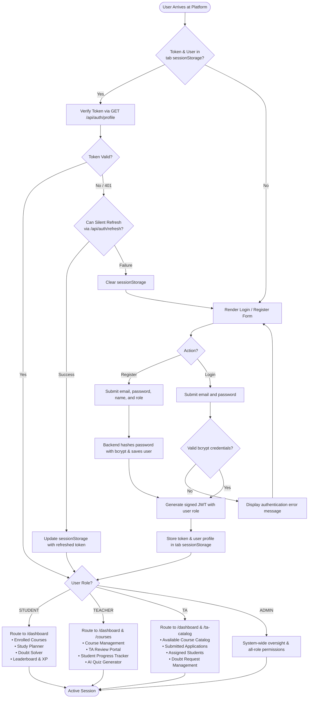
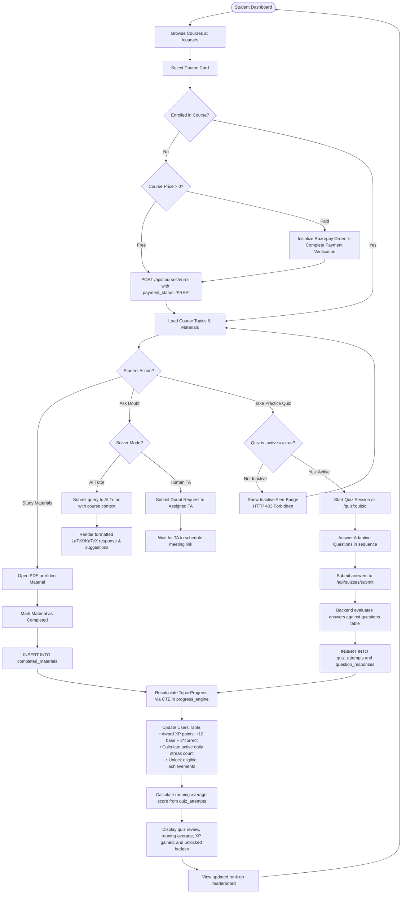
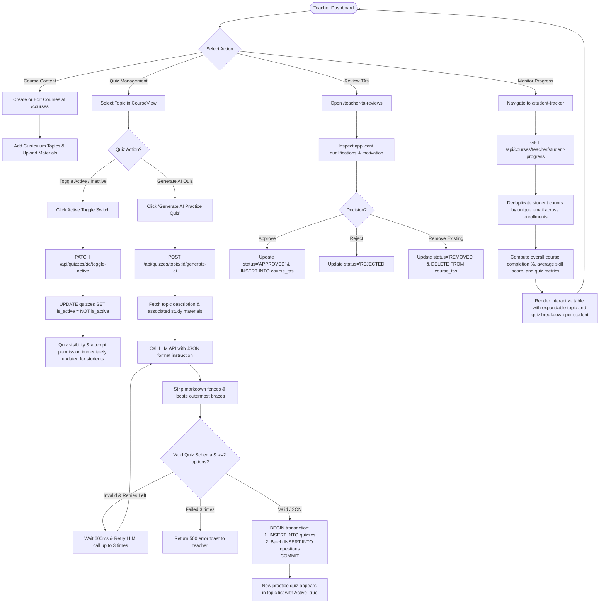

# TailorLearn — Activity Diagrams (System-Level)

This document provides system-level UML activity diagrams represented using Mermaid `flowchart` notation with decision diamonds. It documents user authentication and role routing, the prospective TA lifecycle, the student learning loop, and the teacher course management loop.

---

## 1. Authentication & Role-Based Routing Activity Flow

This diagram illustrates user registration and login, credential authentication, tab-scoped `sessionStorage` token isolation, and role-based interface dispatching.

---

## 2. TA Lifecycle Activity Flow (Apply, Review, Access & Removal)

This diagram tracks the lifecycle of a Teaching Assistant: browsing courses, submitting credentials, instructor review (Approved/Rejected), course and student data access, and eventual removal/access revocation.

```mermaid
flowchart TD
    Start([TA Logs In]) --> BrowseCatalog[Browse Available Courses at /ta-catalog]
    BrowseCatalog --> SelectCourse[Select Course to assist]
    SelectCourse --> CheckExisting{Active application exists<br/>in ta_applications?}

    CheckExisting -->|Yes: PENDING or APPROVED| BlockSubmit[Block submission with HTTP 409 Conflict]
    BlockSubmit --> ViewStatus[View pending card at /ta-applications]

    CheckExisting -->|No| OpenForm[Open TA Application Form]
    OpenForm --> FillForm[Provide Qualifications, Motivation, Experience, Contact, Resume Link]
    FillForm --> SubmitApp[POST /api/ta/apply]
    SubmitApp --> SavePending[Save record with status='PENDING']
    SavePending --> ViewStatus

    ViewStatus --> TeacherReviews{Teacher Reviews Application at<br/>/teacher-ta-reviews}

    TeacherReviews -->|REJECT| SetRejected[Update ta_applications status='REJECTED']
    SetRejected --> NotifReject[Send in-app notification & rejection email]
    NotifReject --> EndReject([Application Terminated])

    TeacherReviews -->|APPROVE| SetApproved[Update ta_applications status='APPROVED']
    SetApproved --> InsertCourseTas[INSERT INTO course_tas ta_id, course_id]
    InsertCourseTas --> NotifApprove[Send in-app notification & approval email]
    NotifApprove --> GainedAccess[TA gains course access rights]

    GainedAccess --> TADuties[TA conducts duties:<br/>• View enrolled students at /ta-assigned<br/>• Schedule doubt sessions at /ta-requests<br/>• Attach Google Meet / Zoom link]

    TADuties --> TeacherAudit{Teacher Audit Decision}
    TeacherAudit -->|Keep Active| TADuties
    TeacherAudit -->|Remove TA| TeacherRemoves[Teacher clicks 'Remove TA']
    TeacherRemoves --> SetRemoved[Update ta_applications status='REMOVED']
    SetRemoved --> RevokeAccess[DELETE FROM course_tas WHERE ta_id=$1 AND course_id=$2]
    RevokeAccess --> NotifRemoved[Send in-app notification & removal email]
    NotifRemoved --> AccessRevoked([Course Access Immediately Terminated])
```

---

## 3. Student Core Learning Loop Activity Flow

This diagram documents a student's core interaction loop: course discovery, enrollment, curriculum review, the active/inactive quiz gate, scoring, dynamic topic progress recalculation via PostgreSQL CTE, and gamification feedback.

---

## 4. Teacher Course & Assessment Management Core Loop

This diagram models an instructor's operations: managing course topics, toggling quiz accessibility, generating AI quizzes with automated validation/retries, and monitoring student analytics with email deduplication.

