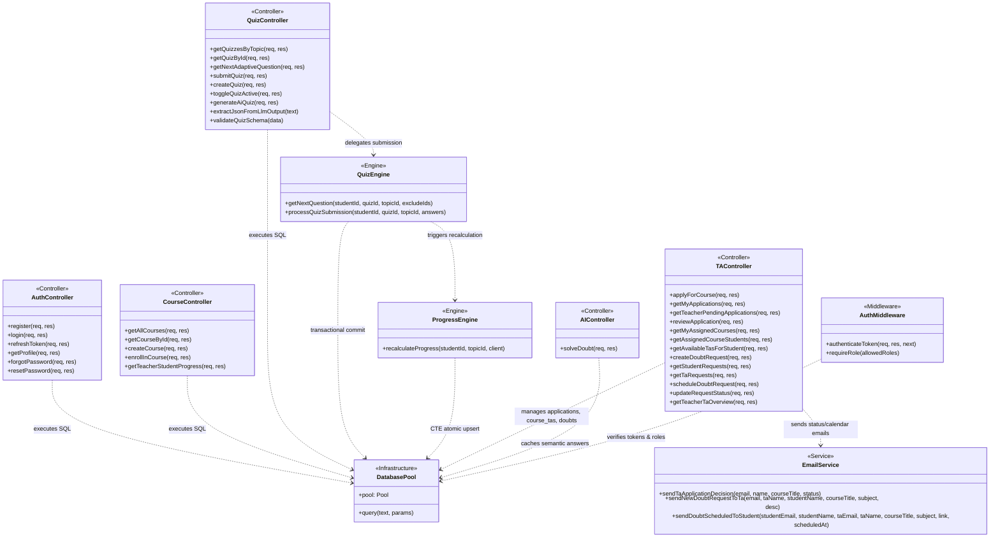

# TailorLearn — Class Diagram (Domain Model & System Architecture)

> [!NOTE]
> **Codebase Architecture Disclosure**:  
> The TailorLearn backend is implemented in a **functional and procedural style** using Node.js, Express route handlers, and raw parameterized PostgreSQL queries via `pg.Pool` (without an Object-Relational Mapper like Sequelize or TypeORM). There are no native JavaScript ES6/TypeScript class declarations for the database models.
> 
> In compliance with the prompt guidelines, **Diagram 1** represents the **Conceptual Domain Model Class Diagram** reflecting the business entities, specialized user roles, encapsulated operations, and relationships. **Diagram 2** documents the **Actual Architectural Module Structure** showing how controllers, engines, middleware, and services interact in code.

---

## 1. Conceptual Domain Model

This conceptual class diagram models the business domain: `User` with role subtypes (`Student`, `Teacher`, `TA`), `Course`, `Topic`, `LearningMaterial`, `Quiz`, `Question`, `QuizAttempt`, `QuestionResponse`, `TAApplication`, and `DoubtRequest`. Methods represent core domain actions implemented across the controllers and engines.

```mermaid
classDiagram
    direction TB

    class User {
        <<Entity>>
        +UUID id
        +String email
        +String passwordHash
        +String firstName
        +String lastName
        +UserRole role
        +Integer xpPoints
        +Integer streakCount
        +Date lastActiveDate
        +register(email, password, role)
        +login(email, password)
        +updateStreak()
        +awardXp(points)
    }

    class Student {
        <<Role Subtype>>
        +Integer totalEnrollments
        +enrollInCourse(courseId)
        +takeQuiz(quizId)
        +submitAttempt(quizId, answers)
        +requestDoubtSession(taId, courseId, subject, description)
        +completeMaterial(materialId)
        +generateStudyPlan(goal, hoursDaily)
    }

    class Teacher {
        <<Role Subtype>>
        +createCourse(title, description, price)
        +addTopic(courseId, title, sequence)
        +reviewTAApplication(applicationId, decision)
        +createQuiz(topicId, title, passingScore)
        +generateAiQuiz(topicId)
        +toggleQuizActive(quizId, isActive)
        +getStudentProgressAnalytics()
    }

    class TA {
        <<Role Subtype>>
        +applyForCourse(courseId, qualifications, motivation)
        +viewAssignedCourses()
        +viewAssignedCourseStudents(courseId)
        +scheduleDoubtMeeting(requestId, meetingLink, scheduledAt)
        +resolveDoubtRequest(requestId)
    }

    class Course {
        <<Entity>>
        +UUID id
        +String title
        +String description
        +Numeric price
        +UUID teacherId
        +DateTime createdAt
        +getDistinctStudentCount()
        +getAssignedTAs()
    }

    class Topic {
        <<Entity>>
        +UUID id
        +UUID courseId
        +String title
        +String description
        +Integer sequenceOrder
        +getMaterials()
        +getQuizzes()
    }

    class LearningMaterial {
        <<Entity>>
        +UUID id
        +UUID topicId
        +String title
        +String type
        +String fileUrl
        +markCompletedBy(studentId)
    }

    class Quiz {
        <<Entity>>
        +UUID id
        +UUID topicId
        +String title
        +Integer passingScore
        +Boolean isActive
        +DateTime createdAt
        +toggleActive(state)
        +getQuestions()
        +isEligibleForAttempt(userRole)
    }

    class Question {
        <<Entity>>
        +UUID id
        +UUID quizId
        +String content
        +JSONB options
        +String correctOptionId
        +Difficulty difficulty
        +validateAnswer(selectedOptionId)
    }

    class QuizAttempt {
        <<Entity>>
        +UUID id
        +UUID studentId
        +UUID quizId
        +Integer score
        +DateTime completedAt
        +calculateScore(answers)
        +calculateRunningAverage(studentId, quizId)
    }

    class QuestionResponse {
        <<Entity>>
        +UUID id
        +UUID attemptId
        +UUID questionId
        +UUID studentId
        +Boolean isCorrect
        +String selectedOptionId
        +Integer timeSpentSeconds
    }

    class Progress {
        <<Entity>>
        +UUID id
        +UUID studentId
        +UUID topicId
        +Integer skillScore
        +Integer completionPercentage
        +DateTime lastStudiedAt
        +recalculate(studentId, topicId)
    }

    class TAApplication {
        <<Entity>>
        +UUID id
        +UUID taId
        +UUID courseId
        +String fullName
        +String contact
        +String qualification
        +String motivation
        +String experience
        +String resumeLink
        +ApplicationStatus status
        +DateTime createdAt
        +DateTime reviewedAt
        +UUID reviewedBy
        +approve(teacherId)
        +reject(teacherId)
        +remove(teacherId)
    }

    class DoubtRequest {
        <<Entity>>
        +UUID id
        +UUID studentId
        +UUID taId
        +UUID courseId
        +String subject
        +String description
        +DoubtStatus status
        +String meetingLink
        +DateTime scheduledAt
        +DateTime createdAt
        +schedule(meetingLink, scheduledAt)
        +resolve()
        +decline()
    }

    class CourseTAAssignment {
        <<Association>>
        +UUID id
        +UUID taId
        +UUID courseId
        +DateTime assignedAt
    }

    %% Inheritance / Subtyping
    User <|-- Student : specializes (role=STUDENT)
    User <|-- Teacher : specializes (role=TEACHER)
    User <|-- TA : specializes (role=TA)

    %% Relationships
    Teacher "1" -- "0..*" Course : creates / owns
    Course "1" *-- "1..*" Topic : consists of
    Topic "1" *-- "0..*" LearningMaterial : contains
    Topic "1" *-- "0..*" Quiz : assessed by
    Quiz "1" *-- "1..*" Question : composed of

    Student "1" -- "0..*" QuizAttempt : submits
    Quiz "1" -- "0..*" QuizAttempt : attempted on
    QuizAttempt "1" *-- "1..*" QuestionResponse : records
    Question "1" -- "0..*" QuestionResponse : answered in

    Student "1" -- "0..*" Progress : tracks
    Topic "1" -- "0..*" Progress : evaluated on

    TA "1" -- "0..*" TAApplication : submits
    Course "1" -- "0..*" TAApplication : targets
    Teacher "0..1" -- "0..*" TAApplication : reviews

    TA "1" -- "0..*" CourseTAAssignment : assigned to
    Course "1" -- "0..*" CourseTAAssignment : has assigned

    Student "1" -- "0..*" DoubtRequest : creates
    TA "1" -- "0..*" DoubtRequest : handles
    Course "1" -- "0..*" DoubtRequest : scoped to
```

---

## 2. Actual Codebase Architecture (Controllers & Services)

This diagram documents the actual modular structure implemented in `backend/`: Express routers, controllers, computational engines, database connection pool, and email services.

