# TailorLearn — Collaboration Diagrams

> [!NOTE]
> Mermaid does not have a native UML collaboration (communication) diagram type. Per standard UML practices in Mermaid, collaboration diagrams are represented as spatial **`flowchart`** graphs with architectural objects/components as vertices and **numbered, directional message edges** specifying the exact chronological sequence of interactions.

---

## 1. TA Approval, Course Access & Revocation Collaboration Diagram

This diagram displays the spatial interaction network between the Teacher, Teaching Assistant, Course Controller, Email Service, and PostgreSQL database tables during the TA application, approval, access assignment, and subsequent removal.

```mermaid
flowchart TD
    %% Entities / Components
    TA_Actor["👤 Teaching Assistant<br/>[TA User]"]
    Teacher_Actor["👤 Course Teacher<br/>[Teacher User]"]
    
    subgraph Frontend ["Frontend Clients (TaPages.jsx)"]
        TA_UI["💻 TA Web Interface<br/>(TaCourseCatalog / TaAssigned)"]
        Tch_UI["💻 Teacher Web Interface<br/>(TeacherTaReview)"]
    end

    subgraph Backend ["Backend API & Services"]
        TACtrl["⚙️ TA Controller<br/>(ta_controller.js)"]
        EmailSvc["📧 Email Service<br/>(email_service.js)"]
    end

    subgraph Database ["PostgreSQL Relational Storage"]
        DB_Apps[("📄 ta_applications<br/>(status: PENDING/APPROVED/REMOVED)")]
        DB_CourseTas[("🔑 course_tas<br/>(active assignment link)")]
        DB_Courses[("📚 courses")]
        DB_Notifs[("🔔 notifications")]
        DB_Enroll[("🎓 enrollments & users<br/>(students)")]
    end

    %% Message Flows: Application
    TA_Actor -->|"1: Submits application form"| TA_UI
    TA_UI -->|"1.1: POST /api/ta/apply"| TACtrl
    TACtrl -->|"1.2: Check no active app exists"| DB_Apps
    TACtrl -->|"1.3: INSERT status='PENDING'"| DB_Apps
    TACtrl -.->|"1.4: 201 Created (Pending)"| TA_UI

    %% Message Flows: Teacher Review
    Teacher_Actor -->|"2: Opens pending applications"| Tch_UI
    Tch_UI -->|"2.1: GET /api/ta/teacher/applications"| TACtrl
    TACtrl -->|"2.2: SELECT apps JOIN courses"| DB_Apps
    DB_Courses --- DB_Apps
    TACtrl -.->|"2.3: 200 OK [applications]"| Tch_UI

    %% Message Flows: Approval
    Teacher_Actor -->|"3: Clicks 'Approve'"| Tch_UI
    Tch_UI -->|"3.1: PUT /api/ta/applications/:id/review (status='APPROVED')"| TACtrl
    TACtrl -->|"3.2: UPDATE status='APPROVED'"| DB_Apps
    TACtrl -->|"3.3: INSERT (ta_id, course_id) ON CONFLICT DO NOTHING"| DB_CourseTas
    TACtrl -->|"3.4: INSERT notification"| DB_Notifs
    TACtrl -->|"3.5: sendTaApplicationDecision('APPROVED')"| EmailSvc
    EmailSvc -.->|"3.6: Dispatches approval email"| TA_Actor
    TACtrl -.->|"3.7: 200 OK"| Tch_UI

    %% Message Flows: Removal / Revocation
    Teacher_Actor -->|"4: Clicks 'Remove TA'"| Tch_UI
    Tch_UI -->|"4.1: PUT /api/ta/applications/:id/review (status='REMOVED')"| TACtrl
    TACtrl -->|"4.2: UPDATE status='REMOVED'"| DB_Apps
    TACtrl -->|"4.3: DELETE FROM course_tas (Revoke Access)"| DB_CourseTas
    TACtrl -->|"4.4: INSERT revocation notification"| DB_Notifs
    TACtrl -->|"4.5: sendTaApplicationDecision('REMOVED')"| EmailSvc
    EmailSvc -.->|"4.6: Dispatches removal email"| TA_Actor
    TACtrl -.->|"4.7: 200 OK"| Tch_UI

    %% Message Flows: Assigned Course Access Guard
    TA_Actor -->|"5: Views assigned students"| TA_UI
    TA_UI -->|"5.1: GET /api/ta/courses/:id/students"| TACtrl
    TACtrl -->|"5.2: Guard: SELECT FROM course_tas"| DB_CourseTas
    TACtrl -->|"5.3: SELECT enrolled students & progress"| DB_Enroll
    TACtrl -.->|"5.4: 200 OK [students data]"| TA_UI
```



---

## 2. Quiz Attempt, Scoring & Progress Recalculation Collaboration Diagram

This diagram displays the collaborative message interactions between the Student client, Quiz Controller, Quiz Engine, Progress Engine, and Database during quiz attempt verification, batch question evaluation, atomic CTE progress recalculation, and streak/XP assignment.

```mermaid
flowchart TD
    %% Actors and Frontend
    Student_Actor["👤 Student"]
    Student_UI["💻 Quiz Client<br/>(QuizView.jsx)"]

    %% Backend Controllers and Engines
    subgraph ProcessingCore ["Backend Execution Core"]
        QCtrl["⚙️ Quiz Controller<br/>(quiz_controller.js)"]
        QEng["🧮 Quiz Engine<br/>(quiz_engine.js)"]
        PEng["📈 Progress Engine<br/>(progress_engine.js)"]
    end

    %% Database Stores
    subgraph DataStorage ["PostgreSQL Database"]
        DB_Quizzes[("📝 quizzes<br/>(is_active flag)")]
        DB_Questions[("❓ questions")]
        DB_Attempts[("🎯 quiz_attempts")]
        DB_Responses[("📋 question_responses")]
        DB_Progress[("📊 progress")]
        DB_Users[("👤 users<br/>(xp_points, streaks)")]
        DB_Badges[("🏆 user_achievements")]
    end

    %% Step 1: Question Fetching
    Student_Actor -->|"1: Requests next adaptive question"| Student_UI
    Student_UI -->|"1.1: GET /api/quizzes/:id/next"| QCtrl
    QCtrl -->|"1.2: SELECT is_active gate"| DB_Quizzes
    QCtrl -->|"1.3: getNextQuestion(studentId, quizId)"| QEng
    QEng -->|"1.4: SELECT RANDOM() question"| DB_Questions
    QEng -.->|"1.5: Return question"| QCtrl
    QCtrl -.->|"1.6: 200 OK {question}"| Student_UI

    %% Step 2: Submission & Evaluation
    Student_Actor -->|"2: Submits quiz answers"| Student_UI
    Student_UI -->|"2.1: POST /api/quizzes/submit {quizId, responses}"| QCtrl
    QCtrl -->|"2.2: Verify is_active == true & role == 'STUDENT'"| DB_Quizzes
    QCtrl -->|"2.3: processQuizSubmission(...)"| QEng

    %% Transactional Flow inside QuizEngine
    QEng -->|"2.4: BEGIN transaction"| DB_Attempts
    QEng -->|"2.5: SELECT questions WHERE id = ANY($1)"| DB_Questions
    Note over QEng: Evaluates correct answers in-memory,<br/>calculates score percentage
    QEng -->|"2.6: INSERT INTO quiz_attempts (score)"| DB_Attempts
    QEng -->|"2.7: Multi-row batch INSERT responses"| DB_Responses

    %% Progress Recalculation Flow
    QEng -->|"2.8: recalculateProgress(studentId, topicId)"| PEng
    PEng -->|"2.9: CTE atomic count & upsert completion_percentage"| DB_Progress
    DB_Progress -.->|"2.10: Return updated percentage"| PEng
    PEng -.->|"2.11: Completion percentage"| QEng

    %% Gamification & Leaderboard Updates
    QEng -->|"2.12: SELECT current xp, streak, last_active"| DB_Users
    QEng -->|"2.13: UPDATE xp (+10 base + 2*correct) & streak"| DB_Users
    QEng -->|"2.14: Check & INSERT unlocked badges"| DB_Badges

    %% Average Recalculation
    QEng -->|"2.15: SELECT ROUND(AVG(score)) AS average_score"| DB_Attempts
    QEng -->|"2.16: COMMIT transaction"| DB_Attempts
    QEng -.->|"2.17: Return results payload"| QCtrl
    QCtrl -.->|"2.18: 200 OK {results: score, runningAverageScore, xp}"| Student_UI
    Student_UI -.->|"2.19: Displays score card, running average & badges"| Student_Actor
```
