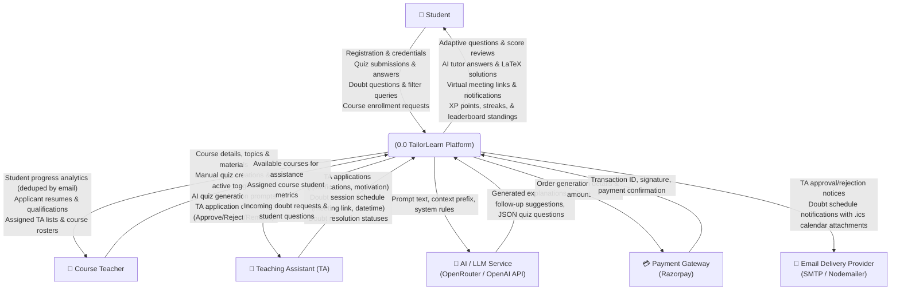

# TailorLearn — Data Flow Diagrams (DFD)

> [!NOTE]
> **DFD Notation in Mermaid**:  
> Mermaid does not provide native Gane-Sarson or Yourdon DFD shapes. Per standard architectural documentation practices in Mermaid, DFD notation is approximated using `flowchart` shapes:
> - **External Entities**: Sharp Rectangles `[Entity Name]`
> - **Processes**: Rounded Rectangles `(Process ID & Name)`
> - **Data Stores**: Cylinder / Open Box notations `[(D# Store Name)]`
> - **Data Flows**: Labeled directional arrows specifying the data conveyed

---

## 1. Level 0 Context Data Flow Diagram

This diagram positions the entire TailorLearn platform as a central single process (`0.0`), showing all external entities (Student, Teacher, Teaching Assistant, AI/LLM Provider, Payment Gateway, and Email Dispatcher) and the primary boundary data flows entering and leaving the system.

---

## 2. Level 1 Data Flow Diagram (Internal Decomposed Processes)

This diagram decomposes TailorLearn into 7 major internal processes and 9 relational data stores, detailing the specific data pipelines and database transactions.

```mermaid
flowchart TB
    %% External Entities
    EE_Student["👤 Student"]
    EE_Teacher["👤 Teacher"]
    EE_TA["👤 TA"]
    EE_LLM["🤖 OpenRouter / OpenAI API"]
    EE_Payment["💳 Razorpay API"]
    EE_Email["📧 Email Service"]

    %% Sub-Processes
    subgraph Processes ["Platform Sub-Processes"]
        P1("(1.0 Auth & Session Management)")
        P2("(2.0 Course & Curriculum Management)")
        P3("(3.0 TA Application & Access Control)")
        P4("(4.0 Quiz & Assessment Engine)")
        P5("(5.0 Doubt Resolution Engine)")
        P6("(6.0 Progress, XP & Gamification)")
        P7("(7.0 Payment & Order Processing)")
    end

    %% Data Stores
    subgraph DataStores ["PostgreSQL Relational Stores"]
        DS_Users[("D1: users")]
        DS_Courses[("D2: courses, topics, materials")]
        DS_Enrollments[("D3: enrollments")]
        DS_Quizzes[("D4: quizzes & questions")]
        DS_Attempts[("D5: quiz_attempts & responses")]
        DS_Progress[("D6: progress & completed_materials")]
        DS_TA[("D7: ta_applications & course_tas")]
        DS_Doubts[("D8: ta_requests")]
        DS_AICache[("D9: ai_query_cache")]
    end

    %% 1.0 Auth Flows
    EE_Student -->|"Credentials (email, password, role)"| P1
    EE_Teacher -->|"Credentials (email, password, role)"| P1
    EE_TA -->|"Credentials (email, password, role)"| P1
    P1 -->|"Check credentials / Save user"| DS_Users
    DS_Users -->|"User profile & hashed password"| P1
    P1 -->|"Tab-isolated JWT & session profile"| EE_Student
    P1 -->|"Tab-isolated JWT & session profile"| EE_Teacher
    P1 -->|"Tab-isolated JWT & session profile"| EE_TA

    %% 2.0 Course Management Flows
    EE_Teacher -->|"Course details, topics, PDFs, video URLs"| P2
    P2 -->|"Write course curriculum"| DS_Courses
    DS_Courses -->|"Read course catalogue"| P2
    P2 -->|"Course list, topics & study materials"| EE_Student
    P2 -->|"Course list, topics & study materials"| EE_TA

    %% 7.0 Payment & Enrollment Flows
    EE_Student -->|"Course checkout request"| P7
    P7 -->|"Create order"| EE_Payment
    EE_Payment -->|"Payment signature & status"| P7
    P7 -->|"Record payment & enrollment record"| DS_Enrollments

    %% 3.0 TA Management Flows
    EE_TA -->|"Submit application (qualifications, CV link)"| P3
    P3 -->|"Insert application record"| DS_TA
    DS_TA -->|"Read pending applications"| P3
    P3 -->|"Pending applicant list"| EE_Teacher
    EE_Teacher -->|"Application decision (APPROVED / REJECTED / REMOVED)"| P3
    P3 -->|"Update status; INSERT/DELETE from course_tas"| DS_TA
    P3 -->|"Dispatch decision email"| EE_Email
    DS_TA -->|"Verify course access rights"| P3
    P3 -->|"Assigned course student data"| EE_TA

    %% 4.0 Quiz Engine Flows
    EE_Teacher -->|"Manual questions or AI generation prompt"| P4
    P4 -->|"Call LLM with JSON format & retry logic"| EE_LLM
    EE_LLM -->|"Generated quiz JSON"| P4
    P4 -->|"Save quizzes & questions; toggle is_active"| DS_Quizzes
    
    EE_Student -->|"Fetch next question (active gate check)"| P4
    DS_Quizzes -->|"Active status & question data"| P4
    P4 -->|"Question & choices"| EE_Student
    EE_Student -->|"Submit quiz answers"| P4
    P4 -->|"Write attempt score & question responses"| DS_Attempts
    P4 -->|"Trigger progress recalculation"| P6

    %% 5.0 Doubt Resolution Flows
    EE_Student -->|"Ask AI Tutor with course context"| P5
    P5 -->|"Check context-keyed query"| DS_AICache
    DS_AICache -->|"Cached answer hit"| P5
    P5 -->|"Cache miss: completion prompt"| EE_LLM
    EE_LLM -->|"Answer text & suggestions"| P5
    P5 -->|"Store new query & answer"| DS_AICache
    P5 -->|"Delivered answer + follow-up chips"| EE_Student

    EE_Student -->|"Submit Human TA doubt request"| P5
    P5 -->|"Insert doubt request (status=PENDING)"| DS_Doubts
    DS_Doubts -->|"Read incoming doubts"| P5
    P5 -->|"Incoming doubt tickets"| EE_TA
    EE_TA -->|"Schedule meeting link & datetime"| P5
    P5 -->|"Update status=SCHEDULED & meeting_link"| DS_Doubts
    P5 -->|"Send calendar email (.ics)"| EE_Email
    EE_TA -->|"Mark doubt RESOLVED"| P5
    EE_Student -->|"Mark doubt RESOLVED"| P5
    P5 -->|"Update status=RESOLVED (removes link)"| DS_Doubts

    %% 6.0 Progress, XP & Analytics Flows
    EE_Student -->|"Mark material completed"| P6
    P6 -->|"Record completed material"| DS_Progress
    P6 -->|"Atomic CTE: compute completion %"| DS_Progress
    P6 -->|"Update streak & XP points (+10 base, +2 correct)"| DS_Users
    P6 -->|"Running average score & progress stats"| EE_Student

    DS_Enrollments -->|"Enrolled student data"| P2
    DS_Progress -->|"Student progress data"| P2
    DS_Attempts -->|"Quiz score data"| P2
    P2 -->|"Student Progress Tracker (deduped by email)"| EE_Teacher
```

