# TailorLearn — Entity Relationship (ER) Diagram

This document illustrates the actual PostgreSQL database schema implemented in TailorLearn, extracted directly from `database/schema.sql` and the database migration scripts (`migrate_quiz_and_ta_removed.js`). It includes all 21 tables, primary keys, foreign keys, key domain attributes (such as `is_active`, statuses, and deduplication keys), and table relationships with strict cardinality.

```mermaid
erDiagram
    USERS {
        uuid id PK "Primary Key"
        varchar email UK "Unique student/teacher/TA identifier (used in dedup)"
        varchar password_hash "Hashed user password"
        varchar first_name "Given name"
        varchar last_name "Surname"
        user_role role "STUDENT, TEACHER, ADMIN, TA"
        integer xp_points "Gamification XP points"
        integer streak_count "Daily consecutive learning streak"
        date last_active_date "Last platform interaction date"
        varchar reset_token "Password reset token"
        timestamptz reset_token_expiry "Expiry timestamp"
        timestamptz created_at "Account creation"
        timestamptz updated_at "Account update"
    }

    COURSES {
        uuid id PK "Primary Key"
        varchar title "Course name"
        text description "Course summary and curriculum details"
        numeric price "Enrollment price (0.00 for free)"
        uuid teacher_id FK "References USERS(id) ON DELETE SET NULL"
        timestamptz created_at "Creation timestamp"
    }

    ENROLLMENTS {
        uuid id PK "Primary Key"
        uuid student_id FK "References USERS(id) ON DELETE CASCADE"
        uuid course_id FK "References COURSES(id) ON DELETE CASCADE"
        varchar payment_status "FREE, PAID, PENDING, FAILED"
        timestamptz enrolled_at "Enrollment date"
    }

    PAYMENTS {
        uuid id PK "Primary Key"
        uuid student_id FK "References USERS(id) ON DELETE CASCADE"
        uuid course_id FK "References COURSES(id) ON DELETE CASCADE"
        varchar razorpay_order_id UK "Razorpay Order Reference"
        varchar razorpay_payment_id "Razorpay Payment Reference"
        varchar razorpay_signature "Cryptographic webhook signature"
        numeric amount "Payment sum in INR"
        varchar status "PENDING, SUCCESS, FAILED, REFUNDED"
        timestamptz created_at "Payment attempt time"
    }

    TOPICS {
        uuid id PK "Primary Key"
        uuid course_id FK "References COURSES(id) ON DELETE CASCADE"
        varchar title "Topic title"
        text description "Topic curriculum description"
        integer sequence_order "Sequential lesson order"
        timestamptz created_at "Creation timestamp"
    }

    MATERIALS {
        uuid id PK "Primary Key"
        uuid topic_id FK "References TOPICS(id) ON DELETE CASCADE"
        varchar title "Material headline"
        varchar type "PDF or VIDEO"
        text file_url "Storage location or CDN link"
        timestamptz created_at "Upload timestamp"
    }

    QUIZZES {
        uuid id PK "Primary Key"
        uuid topic_id FK "References TOPICS(id) ON DELETE CASCADE"
        varchar title "Quiz title"
        integer passing_score "Passing percentage threshold"
        boolean is_active "True: open for attempts, False: inactive gate"
        timestamptz created_at "Creation timestamp"
    }

    QUESTIONS {
        uuid id PK "Primary Key"
        uuid quiz_id FK "References QUIZZES(id) ON DELETE CASCADE"
        text content "Question text and Markdown"
        jsonb options "Array of choices [{id: A, text: ...}]"
        varchar correct_option_id "Identifier of the correct option"
        question_difficulty difficulty "EASY, MEDIUM, HARD"
        timestamptz created_at "Creation timestamp"
    }

    QUIZ_ATTEMPTS {
        uuid id PK "Primary Key"
        uuid student_id FK "References USERS(id) ON DELETE CASCADE"
        uuid quiz_id FK "References QUIZZES(id) ON DELETE CASCADE"
        integer score "Calculated percentage score (0-100)"
        timestamptz completed_at "Submission timestamp"
    }

    QUESTION_RESPONSES {
        uuid id PK "Primary Key"
        uuid attempt_id FK "References QUIZ_ATTEMPTS(id) ON DELETE CASCADE"
        uuid question_id FK "References QUESTIONS(id) ON DELETE CASCADE"
        uuid student_id FK "References USERS(id) ON DELETE CASCADE"
        boolean is_correct "Whether selected answer was correct"
        varchar selected_option_id "Option selected by student"
        integer time_spent_seconds "Duration spent answering"
    }

    PROGRESS {
        uuid id PK "Primary Key"
        uuid student_id FK "References USERS(id) ON DELETE CASCADE"
        uuid topic_id FK "References TOPICS(id) ON DELETE CASCADE"
        integer skill_score "Skill mastery rating (0-100)"
        integer completion_percentage "Dynamic weighted completion (0-100)"
        timestamptz last_studied_at "Last interaction timestamp"
    }

    COMPLETED_MATERIALS {
        uuid id PK "Primary Key"
        uuid student_id FK "References USERS(id) ON DELETE CASCADE"
        uuid material_id FK "References MATERIALS(id) ON DELETE CASCADE"
        timestamptz completed_at "Material completion timestamp"
    }

    STUDY_PLANS {
        uuid id PK "Primary Key"
        uuid student_id FK "References USERS(id) ON DELETE CASCADE"
        text goal "Target learning goal"
        numeric available_hours_daily "Study hours per day"
        date start_date "Plan start"
        date end_date "Target finish"
        jsonb plan_schedule "Generated daily topics and milestone schedule"
        timestamptz created_at "Creation timestamp"
    }

    SPACED_REPETITION {
        uuid id PK "Primary Key"
        uuid student_id FK "References USERS(id) ON DELETE CASCADE"
        uuid material_id FK "References MATERIALS(id) ON DELETE CASCADE"
        integer interval_days "Days until next review (SM-2)"
        numeric easiness_factor "EF multiplier (default 2.50)"
        integer repetitions "Consecutive successful reviews"
        date next_review_date "Calculated due date"
        timestamptz last_reviewed_at "Previous review timestamp"
    }

    ACHIEVEMENTS {
        uuid id PK "Primary Key"
        varchar title "Badge title"
        text description "Badge requirements description"
        text icon_url "Badge icon graphic link"
        varchar condition_type "XP, STREAK, QUIZ_PERFECT"
        integer condition_value "Target threshold to trigger unlock"
    }

    USER_ACHIEVEMENTS {
        uuid id PK "Primary Key"
        uuid student_id FK "References USERS(id) ON DELETE CASCADE"
        uuid achievement_id FK "References ACHIEVEMENTS(id) ON DELETE CASCADE"
        timestamptz unlocked_at "Unlock timestamp"
    }

    NOTIFICATIONS {
        uuid id PK "Primary Key"
        uuid user_id FK "References USERS(id) ON DELETE CASCADE"
        varchar title "Notification title"
        text message "Body text"
        boolean is_read "Read receipt flag"
        timestamptz created_at "Creation timestamp"
    }

    AI_QUERY_CACHE {
        uuid id PK "Primary Key"
        text query_text UK "Context-prefixed query string"
        text answer_text "Cached LLM response text"
        timestamptz created_at "Cached timestamp"
    }

    TA_APPLICATIONS {
        uuid id PK "Primary Key"
        uuid ta_id FK "References USERS(id) ON DELETE CASCADE"
        uuid course_id FK "References COURSES(id) ON DELETE CASCADE"
        varchar full_name "Applicant name"
        varchar contact "Phone or contact handle"
        varchar qualification "Academic credentials"
        text motivation "Statement of interest"
        text experience "Prior tutoring experience"
        text resume_link "External URL to CV/Portfolio"
        varchar status "PENDING, APPROVED, REJECTED, REMOVED"
        timestamptz created_at "Application date"
        timestamptz reviewed_at "Review timestamp"
        uuid reviewed_by FK "References USERS(id) ON DELETE SET NULL"
    }

    COURSE_TAS {
        uuid id PK "Primary Key"
        uuid ta_id FK "References USERS(id) ON DELETE CASCADE"
        uuid course_id FK "References COURSES(id) ON DELETE CASCADE"
        timestamptz assigned_at "Assignment timestamp"
    }

    TA_REQUESTS {
        uuid id PK "Primary Key"
        uuid student_id FK "References USERS(id) ON DELETE CASCADE"
        uuid ta_id FK "References USERS(id) ON DELETE CASCADE"
        uuid course_id FK "References COURSES(id) ON DELETE CASCADE"
        text subject "Doubt subject header"
        text description "Detailed question description"
        varchar status "PENDING, SCHEDULED, RESOLVED, DECLINED"
        text meeting_link "Google Meet / Zoom URL"
        timestamptz scheduled_at "Meeting timestamp"
        timestamptz created_at "Request timestamp"
    }

    %% Relationships and Cardinalities
    USERS ||--o{ COURSES : "teacher_id: creates/teaches"
    USERS ||--o{ ENROLLMENTS : "student_id: enrolls"
    COURSES ||--o{ ENROLLMENTS : "course_id: contains"

    USERS ||--o{ PAYMENTS : "student_id: pays for"
    COURSES ||--o{ PAYMENTS : "course_id: billed in"

    COURSES ||--o{ TOPICS : "course_id: structured into"
    TOPICS ||--o{ MATERIALS : "topic_id: has study items"
    TOPICS ||--o{ QUIZZES : "topic_id: assessed with"

    QUIZZES ||--o{ QUESTIONS : "quiz_id: contains"
    QUIZZES ||--o{ QUIZ_ATTEMPTS : "quiz_id: taken via"
    USERS ||--o{ QUIZ_ATTEMPTS : "student_id: attempts"

    QUIZ_ATTEMPTS ||--o{ QUESTION_RESPONSES : "attempt_id: logs"
    QUESTIONS ||--o{ QUESTION_RESPONSES : "question_id: evaluated in"
    USERS ||--o{ QUESTION_RESPONSES : "student_id: answered by"

    USERS ||--o{ PROGRESS : "student_id: tracks"
    TOPICS ||--o{ PROGRESS : "topic_id: monitored for"

    USERS ||--o{ COMPLETED_MATERIALS : "student_id: completes"
    MATERIALS ||--o{ COMPLETED_MATERIALS : "material_id: completed by"

    USERS ||--o{ STUDY_PLANS : "student_id: owns"

    USERS ||--o{ SPACED_REPETITION : "student_id: reviews"
    MATERIALS ||--o{ SPACED_REPETITION : "material_id: scheduled in"

    ACHIEVEMENTS ||--o{ USER_ACHIEVEMENTS : "achievement_id: awarded as"
    USERS ||--o{ USER_ACHIEVEMENTS : "student_id: earns"

    USERS ||--o{ NOTIFICATIONS : "user_id: receives"

    USERS ||--o{ TA_APPLICATIONS : "ta_id: submits application"
    COURSES ||--o{ TA_APPLICATIONS : "course_id: applied for"
    USERS ||--o{ TA_APPLICATIONS : "reviewed_by: evaluated by"

    USERS ||--o{ COURSE_TAS : "ta_id: assigned as TA"
    COURSES ||--o{ COURSE_TAS : "course_id: has assigned TAs"

    USERS ||--o{ TA_REQUESTS : "student_id: requests doubt help"
    USERS ||--o{ TA_REQUESTS : "ta_id: resolves doubt"
    COURSES ||--o{ TA_REQUESTS : "course_id: doubt context"
```

## Business-Logic Key Notes

1. **Student Deduplication via Email Across Course Enrollments**:
   - In `users`, `email` is strictly unique (`UNIQUE NOT NULL`).
   - A single student can hold multiple rows in `enrollments` (one per enrolled course).
   - In teacher/TA analytics (`StudentProgressTracker.jsx` and `getTeacherTaOverview`), metrics perform distinct student counts using `COUNT(DISTINCT u_std.email)` and `new Set(filteredStudents.map(s => s.email.toLowerCase()))` to prevent inflating student counts when an individual enrolls in multiple courses taught by the same instructor.

2. **TA Application Status & Course Access Synchronization**:
   - `ta_applications.status` accepts `'PENDING'`, `'APPROVED'`, `'REJECTED'`, and `'REMOVED'`.
   - A partial unique index `idx_ta_applications_active` on `(ta_id, course_id) WHERE status IN ('PENDING', 'APPROVED')` ensures a TA cannot submit multiple simultaneous active applications for the same course.
   - Course access is decoupled into the join table `course_tas`. When an application transitions to `'APPROVED'`, an entry is inserted into `course_tas`. When the status transitions to `'REJECTED'` or `'REMOVED'`, the entry in `course_tas` is deleted (`DELETE FROM course_tas WHERE ta_id = $1 AND course_id = $2`), instantly revoking course and student inspection access.

3. **Active/Inactive Quiz Gates**:
   - `quizzes.is_active` defaults to `true`. Teachers can toggle this flag.
   - When `is_active = false`, student route handlers (`getNextAdaptiveQuestion`, `submitQuiz`) explicitly reject requests with HTTP 403, and student course views hide or disable the quiz launch button.

4. **Self-Contained AI Query Caching**:
   - `ai_query_cache` is a semantic lookup table keyed by `query_text` (prefixed with `${courseId}:${topicId}:<query>`). It decouples repeated LLM queries from third-party API spend without linking foreign keys.
