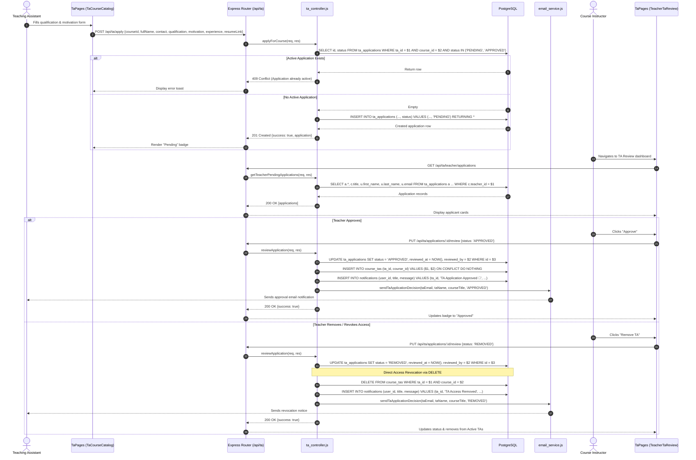
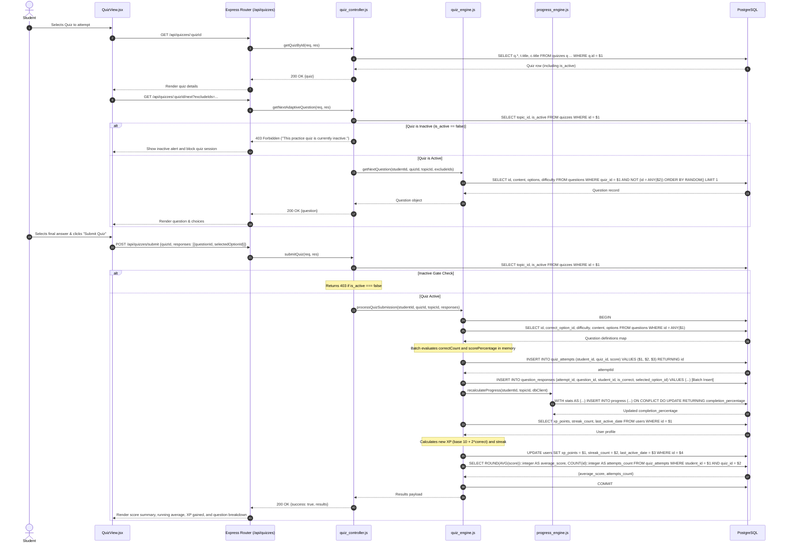
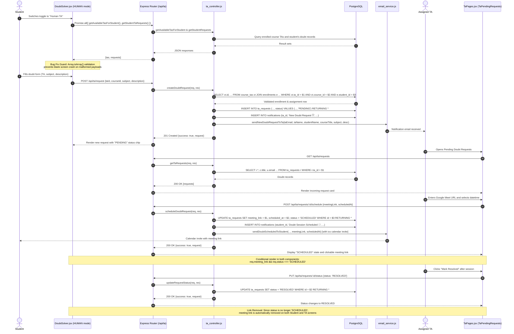
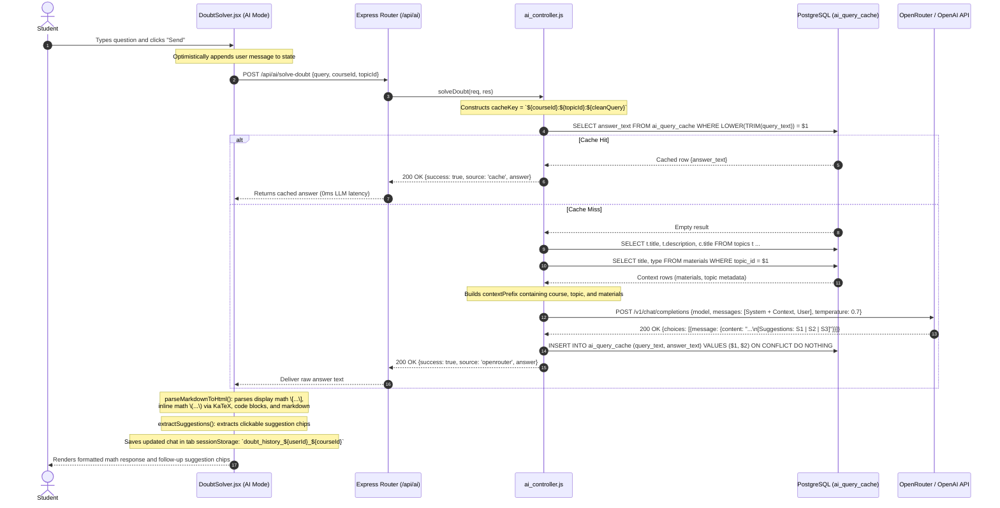
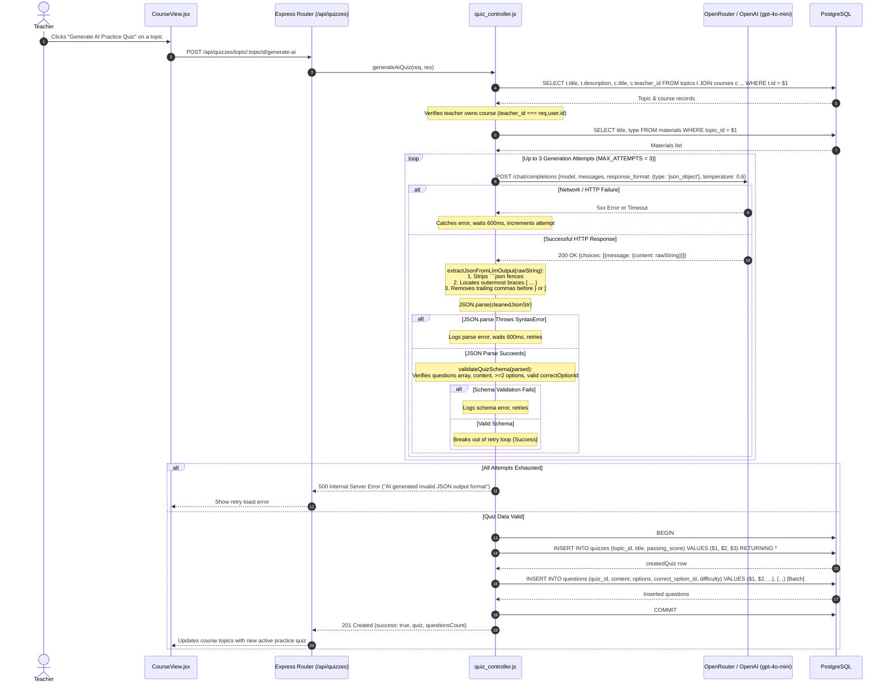

# TailorLearn — Sequence Diagrams

This document provides sequence diagrams tracing the key business flows across frontend components, HTTP API routes, controllers/engines, third-party services, and the PostgreSQL database.

---

## 1. TA Application Submission, Teacher Review & Access Revocation

This diagram illustrates a Teaching Assistant applying for a course, the teacher reviewing pending applications, and the immediate revocation of course access when a TA is removed or rejected.



---

## 2. Student Taking a Quiz & Submitting Attempt

This diagram details question delivery, the inactive-quiz gate, atomic score evaluation, dynamic topic progress recalculation via PostgreSQL CTE, user XP/streak awards, and running average calculation.



---

## 3. Human TA Doubt Session Flow (Blank-Screen Fix, Scheduling & Link Cleanup)

This diagram documents student TA discovery, doubt submission, TA scheduling with `.ics` calendar invitation, and meeting resolution which removes the meeting link on both dashboards.



---

## 4. Student Asking AI Tutor a Question (Contextual Prompt & Semantic Cache)

This diagram details the AI Tutor flow: cache lookup using `${courseId}:${topicId}:${query}`, LLM fallback via OpenRouter/OpenAI, and client-side KaTeX LaTeX and markdown parsing.



---

## 5. AI-Generated Quiz Creation Flow with JSON Parsing & Retry Logic

This diagram captures an instructor generating an AI practice quiz, demonstrating defensive markdown-fence stripping, JSON bracket extraction, schema validation, and automatic retry attempts.



---

## 6. Login Flow & Per-Tab SessionStorage Isolation (Multi-Tab Auth Fix)

This diagram illustrates the authentication flow that resolved multi-tab interference, highlighting tab-scoped `sessionStorage`, background profile verification, mutex-protected silent refresh on 401, and tab-focus rehydration.

```mermaid
sequenceDiagram
    autonumber
    actor User as User (Tab A: Student)
    participant UI_A as Browser Tab A (Student)
    participant Ctx_A as AuthContext (Tab A)
    participant API_Client as api.js (Tab-Scoped Client)
    participant Server as Express Backend (/api/auth)
    participant DB as PostgreSQL (users)
    participant UI_B as Browser Tab B (Teacher)

    %% Step 1: Login in Tab A
    User->>UI_A: Enters student credentials
    UI_A->>Ctx_A: login(email, password)
    Ctx_A->>API_Client: api.login(email, password)
    API_Client->>Server: POST /api/auth/login {email, password}
    Server->>DB: SELECT * FROM users WHERE email = $1
    DB-->>Server: User record (role='STUDENT', password_hash)
    Note over Server: bcrypt.compare() passes; signs JWT with role='STUDENT'
    Server-->>API_Client: 200 OK {token, user: {id, role: 'STUDENT', ...}}
    
    %% Step 2: Tab Isolation Storage
    Note over Ctx_A,API_Client: Stored strictly in sessionStorage (NOT localStorage or shared cookies):<br/>sessionStorage.setItem('token', token)<br/>sessionStorage.setItem('user', JSON.stringify(user))
    Ctx_A-->>UI_A: Updates user state -> Navigates to Student Dashboard

    %% Step 3: Independent Session in Tab B
    Note over UI_B: In Tab B, user logs in as Teacher.<br/>Tab B writes its own teacher JWT to Tab B's sessionStorage.<br/>Tab A's sessionStorage is completely isolated and unaffected!

    %% Step 4: Tab Focus Rehydration
    User->>UI_A: Returns to Tab A (focus / visibilitychange)
    Note over Ctx_A: visibilitychange / focus event fired:<br/>Reads Tab A's sessionStorage;<br/>Detects no mismatch; maintains Student session without flicker

    %% Step 5: Silent Token Refresh (Per-Tab Mutex)
    UI_A->>API_Client: apiCall('/courses/enrolled')
    API_Client->>Server: GET /api/courses/enrolled (Authorization: Bearer <expiredToken>)
    Server-->>API_Client: 401 Unauthorized
    Note over API_Client: apiCall intercepts 401; acquires isRefreshing mutex
    API_Client->>Server: POST /api/auth/refresh {token: currentToken}
    Server->>DB: SELECT id, role FROM users WHERE id = decoded.id
    DB-->>Server: Valid user
    Server-->>API_Client: 200 OK {token: newToken, user}
    Note over API_Client: sessionStorage.setItem('token', newToken);<br/>Replays queued requests with newToken
    API_Client->>Server: GET /api/courses/enrolled (Authorization: Bearer <newToken>)
    Server-->>API_Client: 200 OK [enrolledCourses]
    API_Client-->>UI_A: Displays enrolled courses smoothly
```
